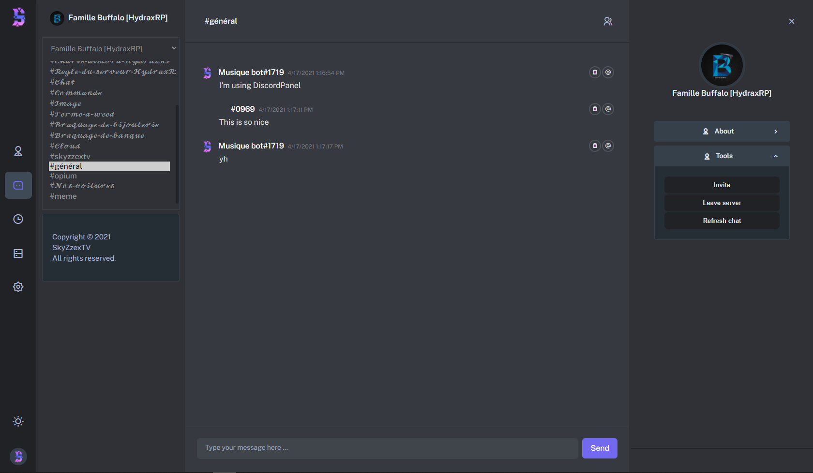

<!-- Logo -->
<p align="center">
  <a href="https://github.com/SkyZzexTV/discordpanel">
    
  </a>
</p>

<!-- Title -->
<h1 align="center">DiscordPanel</h1>
  <p align="center">
    Discord Messaging Panel that allows you to message inside of a bot!
    <br />
    <br />
    <a href=""></a>
    ·
    <a href="https://discord.com/dpYwZT7pNG">Discord Server</a>
    ·
    <a href=""></a>
  </p>
</h1>
<br/><br/>

<!-- Preview -->
<p align="center">
  <a href="">
    
  </a>
  <!-- Drop Shadow -->
  <a href="">
    
  </a>
</p>
<br/>

<!-- Information -->

## What's DiscordPanel?

<a href="https://github.com/SkyZzexTV/DiscordPanel" target="_blank">DiscordPanel</a> is a new panel that allows you to message, manage and gain statistics inside of your discord bot.
<br/>

<!-- Features -->

## ✨ Features

- 📊 **Discord Bot Statistics:** Gain full insights and details of your discord bot with server and bot information.
- 💬 **Simple Messaging Interface:** DiscordPanel allows you to easily message users and chat within servers using your discord bot. The panel also has a light and dark theme to suit your needs!
- 🔒 **Security:** DiscordPanel does not run on any servers and can be self hosted. All bot details are stored locally and is completely secure.
- 👀 **Opensource:** DiscordPanel is open source on GitHub so you can see all the code behind the project.

<br/>

<!-- Getting Started -->

## 🛠 Getting Started

This project does not run on any servers and can be self hosted. Simply open
`index.html` to get started or use the control panel by opening `DiscordPanel.cmd` and executing "W" for the web panel.
<br/>

<!-- Installation -->

### **Step 2:** Setup / Installation

1. Clone the repository

```sh
git clone https://github.com/SkyZzexTV/DiscordPanel
```

> ⚠️ **NOTE**: The updater only works if you have cloned the repository. 

2. Open `login.html` or open `DiscordPanel.cmd` to run the panel.

3. Login to your Discord Bot.

4. Start using DiscordPanel!
   <br/>

### Built With

- [Discord.js](https://github.com/discordjs/discord.js)
- [jQuery](https://jquery.com)
- [Visual Studio Code](https://code.visualstudio.com/)

## License

Copyright © 2021 SkyZzexTV (SkyZzexTV@gmail.com)

Distributed under the GNU General Public License v3.0. See `LICENSE` for more information.
